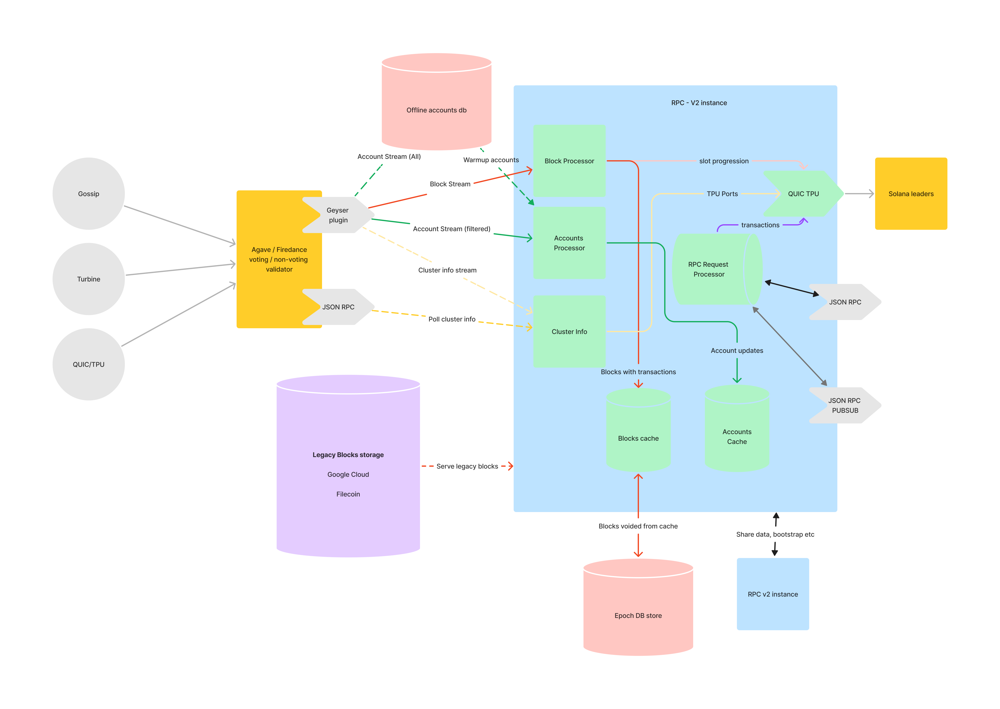

# Overview of RPC-v2 architecture

## Introduction

Solana is a high-performance blockchain platform known for its fast transaction
processing and low fees. However, the infrastructure requirements for running a
Solana validator node can be quite demanding, especially concerning resources
like RAM, CPU, and SSD storage. The current Solana validator RPC imposes
significant constraints, requiring machines with substantial specifications such
as 512 GB RAM, 32-core processors, and 8 TB SSD storage. As the Solana network
grows, adding more RPC nodes only exacerbates these resource constraints due to
the increased load on the network's gossip and turbine components.

To address these challenges and enhance the scalability of the Solana ecosystem,
the Solana community has initiated the RPC-v2 project. This project aims to
reduce the burden on validators by introducing a more efficient RPC mechanism
that allows for the deployment of multiple instances of lightweight RPC-v2 nodes
alongside a single voting or non-voting validator. By doing so, RPC-v2 seeks to
optimize resource utilization, alleviate strain on validators, and facilitate
the seamless expansion of the Solana network.

## Objectives
The primary objectives of the Solana RPC-v2 project are as follows:

1. *Resource Optimization*: Develop a more efficient RPC mechanism that reduces
   the resource requirements for running Solana validator nodes, enabling
   broader participation in the network.

2. *Scalability*: Enable the deployment of multiple instances of lightweight
   RPC-v2 nodes alongside a single voting or non-voting validator, allowing for
   the seamless scaling of the Solana ecosystem.

3. *Improved Network Performance*: Enhance the performance and responsiveness of
   the Solana network by alleviating the load on validators and optimizing
   communication between nodes. Adding some components like packet duplicators
   will help us get a single notification from the validator and send it to
   multiple instances of RPC-v2.

4. *Reduced Operational Costs*: Minimize the operational costs associated with
   running Solana validator nodes by optimizing resource utilization and
   streamlining network infrastructure.

5. *Support GraphQL*: Apart from JSON Rpc we will also intend to support GraphQL
   queries.

## Key Features

The RPC-v2 project introduces several key features to achieve its objectives:

1. *RPC-v2 Instances*: RPC-v2 enables the deployment of lightweight RPC-v2
   instances that consume fewer resources compared to traditional RPC nodes.
   These lite instances are designed to handle specific tasks efficiently, such
   as serving getBlocks, getAccounts or just sending and confirming
   transactions. A single instance can serve one or multiple methods depending
   on configuration.

2. *Integration with Voting/Non-Voting Validators*: RPC-v2 instances as of now
   will avoid replaying blocks (may be will change eventually). They will get
   the blocks and account states from a trusted validator over geyser.

3. *Dynamic Load Balancing*: RPC-v2 incorporates dynamic load balancing mechanisms
   to distribute incoming requests efficiently across multiple RPC instances.
   This ensures optimal resource utilization and prevents individual nodes from
   becoming overwhelmed with excessive traffic.

4. *Improved Fault Tolerance*: By deploying multiple RPC-v2 instances alongside
   validators, the Solana network gains increased fault tolerance and resilience
   to node failures. In the event of a node outage, requests can be seamlessly
   rerouted to other available instances, ensuring uninterrupted service.

5. *Compatibility and Interoperability*: RPC-v2 will be designed to be compatible
   with most of existing Solana client software and APIs, ensuring seamless
   integration with the broader Solana ecosystem. This compatibility enables
   developers to leverage RPC-v2 nodes without requiring extensive modifications
   to their existing applications. Some support to existing RPC methods may not
   be provided by RPC-v2 during the development phase or later, these endpoints
   will be listed exhaustively with the reasons why they are not supported.

## Benefits of RPC-v2

The adoption of Solana RPC-v2 offers several significant benefits to the Solana ecosystem:

1. *Enhanced Scalability*: RPC-v2 enables the Solana network to scale more
   effectively by reducing the resource requirements for running validator
   nodes. This scalability facilitates the growth of decentralized applications
   (dApps) and increases the overall throughput of the network.

2. *Improved Accessibility*: By lowering the barriers to entry for running Solana
   validator nodes, RPC-v2 makes participation in the network more accessible to
   a wider range of users and organizations. This increased accessibility
   fosters greater decentralization and community engagement within the Solana
   ecosystem.

3. *Cost Savings*: RPC-v2 helps reduce the operational costs associated with
   running Solana validator nodes by optimizing resource utilization and
   enabling more efficient infrastructure deployment. This cost savings makes it
   more economical for validators to participate in the network and contributes
   to the long-term sustainability of the Solana ecosystem.

4. *Enhanced Network Performance*: The deployment of lightweight RPC-v2 instances
   alongside validators improves the overall performance and responsiveness of
   the Solana network. This enhanced performance translates to faster
   transaction processing times, lower latency, and a more seamless user
   experience for participants in the network.

## Overall architecture

### Model View Controller (MVC)
Built using a common MVC architecture for modular and maintainable code.
- Router -- Receive client request, route the request to the appropriate
  controller, get formatted response from controller, send it to the client.
  Written as a stand-alone service so it is not tied to load balancer software
  (HAproxy, NGINX, etc).

- Controller -- Get the request from the router, send it to backend, get the
  respsonse from the backend, send the response to the view layer for parsing,
  get the rendered view, and send the response to router to send back to the
  client.

- Views -- Parse the backend response based on the client request. For example,
  jsonParsed TX + parsing from Anchor IDL. Requests for the default format of
  base64 will bypass the view later for better performance.

- Model -- the backend data servers, RPC-v2 instances or validator RPC.

### Model Diagram

### Subject Domains
Solana RPC can be segmented into several subject domains. Each of the domains
can be served from separate backends. The domains are:
- *Transaction* -- methods related to sending and confirming transactions.
- *Accounts* -- methods used to query accounts by id, program, owner, etc.
- *Consensus* -- methods related to validator consensus (leader schedule, stakes,
  vote accounts, etc.)
- *History* -- query transactions and blocks back to genesis
- *Cluster* -- metadata related to cluster epoch data, performance, health, etc.
- Prioritization Fees - meta related to prioritization fees, overall, by
  accounts.

## References 

Solana JSON RPC Api : [https://docs.solana.com/api/http#json-rpc-api-reference]
GraphQL : [https://graphql.org/]