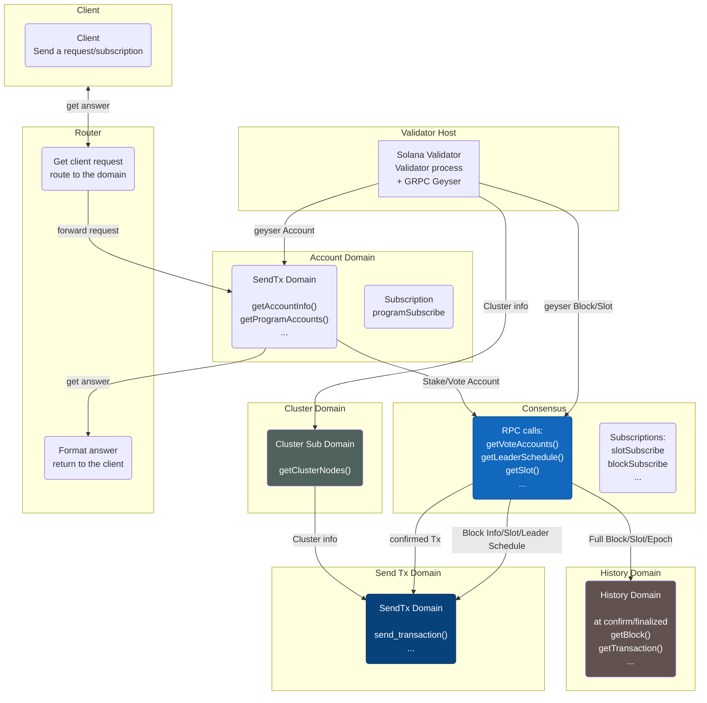

# Architecture

 This page present the way the RPC components can be organized. 

This architecture suppose that RPC call have to works as the V1.

## Key points

Each domain are connected with the others using messages. It allow less dependency and a more flexible set up.

The Router route the client incoming request to the right domains backend

The View format the domains backend answer to the format asked by the clients.

Each domain implements its own access point using the protocol that is the most appropriate (Json, Grpc, GraphQL, ...).

An example of client request routine is presented for the account domain. This is the same for the other domains.

## Diagram

